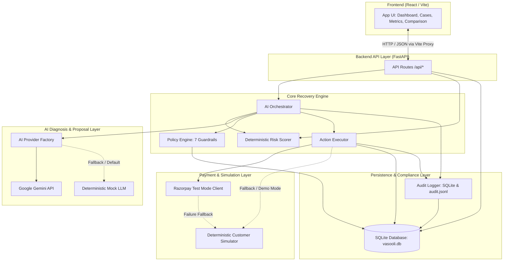
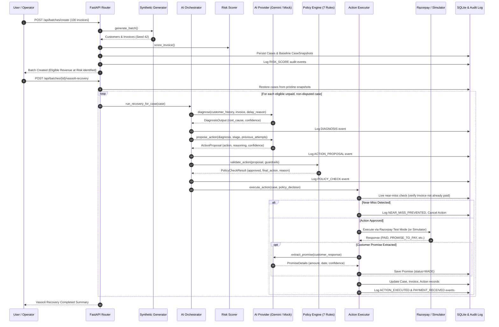

# Vasooli

Vasooli is an AI-powered B2B revenue recovery platform designed to autonomously recover overdue invoices while preserving customer relationships. Built with a FastAPI backend, a React/Vite frontend, and an SQLite database, Vasooli combines automated risk scoring, intelligent AI diagnosis and action proposals (Google Gemini with deterministic mock fallback), a rigorous 7-guardrail deterministic policy engine, Razorpay Test Mode order creation with customer simulation fallback, promise-to-pay extraction, and an immutable audit timeline to achieve measurable recovery lift over standard collection reminders.

---

## Problem

B2B enterprises face substantial working capital blockages due to delayed and unpaid invoices. Conventional manual debt collection suffers from critical operational bottlenecks:
- **High Operational Overhead:** Finance and operations teams spend days manually reviewing overdue accounts, drafting repetitive reminders, and following up across spreadsheets.
- **Low Baseline Conversion:** Standard recovery strategies rely on generic, one-size-fits-all email or letter reminders, typically yielding suboptimal recovery rates (25–35%) on overdue accounts.
- **Lack of Context & Escalation Discipline:** Traditional processes rarely distinguish between transient administrative delays, genuine cash-flow crunches, and legitimate product/service disputes.
- **Safety & Compliance Risks:** Manual or naive automated collection risks contacting customers who have already paid ("near-misses") or pursuing accounts currently under dispute, causing customer friction and compliance leakage.

---

## Solution

Vasooli addresses B2B recovery by transforming collections into an intelligent, policy-governed, multi-stage workflow:
- **Intelligent Diagnosis:** Evaluates overdue invoices, delay reasons, and customer payment history to diagnose root causes (e.g., cash-flow constraints, payment method issues, administrative delays).
- **Context-Aware Action Proposals:** Proposes tailored recovery interventions—from gentle nudges and payment retries to direct payment links, promise-to-pay negotiation, and human escalation.
- **Deterministic Policy Safety Engine:** Enforces 7 strict guardrails that cannot be bypassed by the AI, guaranteeing zero automation leakage on disputed invoices and preventing double-billing on already-paid invoices.
- **Seamless Payment Integration & Simulation:** Integrates with Razorpay Test Mode for direct recovery attempts, backed by a deterministic customer response simulator when test credentials are absent or calls fail.
- **End-to-End Auditability:** Every risk score, LLM diagnosis, policy decision, executed action, customer response, and promise is permanently recorded in both SQLite and an immutable `audit.jsonl` log.

---

## Key Features

- **Automated Synthetic Data Generation:** Generates reproducible batches of 100 realistic B2B customer profiles and invoices (varied overdue intervals, amounts, dispute reasons, and reliability scores) using a fixed seed (`42`).
- **Deterministic Risk Scoring:** Scores overdue invoices from 0 to 100 across 4 components (days overdue, invoice amount, customer reliability score, payment history), categorizing risk as `LOW`, `MEDIUM`, `HIGH`, or `BLOCKED`.
- **Multi-Backend AI Orchestration:** Flexible provider factory (`AIProviderFactory`) supporting Google Gemini (`gemini-3.6-flash`), Anthropic Claude, and an offline deterministic `MockLLM` with automatic graceful fallback.
- **7-Guardrail Policy Engine:** Validates every action against strict business rules:
  1. Automatic blocking of disputed invoices (`dispute_flag = True`).
  2. Automatic cessation for already-paid invoices (`status = "PAID"`).
  3. Maximum contact attempts limit (`MAX_CONTACT_ATTEMPTS = 5`).
  4. Daily contact frequency throttling (`CONTACT_FREQUENCY_PER_DAY = 2`).
  5. Whitelisted action validation per escalation stage (Stages 1 through 4).
  6. Promise-to-Pay cooldown enforcement (`COOLDOWN_AFTER_PROMISE_DAYS = 7`).
  7. Minimum AI confidence score threshold (`PROMISE_CONFIDENCE_THRESHOLD = 0.6`).
- **Near-Miss Prevention:** Live pre-execution verification checks whether an invoice has transitioned to `PAID` immediately before taking action, intercepting redundant outreach and logging a dedicated `near_miss_prevented` audit event.
- **Razorpay Test Mode Integration:** Isolated test client creates bounded orders (`payment_retry`, `payment_link`) via official Razorpay SDK, strictly masking and redacting secret keys.
- **Deterministic Customer Response Simulator:** Simulates realistic customer responses (`paid`, `promise_to_pay`, `partial_payment`, `asks_for_more_time`, `disputes`, `no_response`) based on customer reliability profiles and escalation stages.
- **Promise-to-Pay (PTP) Lifecycle Management:** Extracts promised amounts and dates from unstructured customer replies; tracks commitments through `MADE`, `KEPT`, `BROKEN`, and `RENEGOTIATED` states.
- **Baseline Comparison Engine:** Records immutable baseline snapshots (`CaseSnapshot`) upon batch creation to evaluate Vasooli against standard single-reminder outreach under identical starting conditions and revenue denominators.
- **Complete Visual Dashboard:** Multi-tab responsive React interface featuring KPI cards, interactive Recharts graphs, searchable case lists, detailed modal inspectors, and head-to-head performance comparisons.

---

## Architecture

The following diagram illustrates the component architecture and data flow:



---

## Project Structure

```
vasooli/
├── backend/
│   ├── ai/
│   │   ├── __init__.py
│   │   ├── llm_client.py            # Gemini & Claude LLM provider implementations
│   │   ├── mock_llm.py              # Offline deterministic LLM for mock mode
│   │   └── provider.py              # Abstract base class & AIProviderFactory
│   ├── api/
│   │   ├── __init__.py
│   │   └── routes.py                # FastAPI routes (batches, cases, metrics, promises)
│   ├── config/
│   │   ├── __init__.py
│   │   ├── constants.py             # Enums, action types, risk thresholds, policy limits
│   │   └── settings.py              # Pydantic/dotenv application configuration
│   ├── core/
│   │   ├── __init__.py
│   │   ├── ai_orchestrator.py       # Coordinates diagnosis, proposal, policy, & execution
│   │   ├── audit_logger.py          # Dual persistence logger (SQLite + audit.jsonl)
│   │   └── policy_engine.py         # 7 deterministic guardrails
│   └── risk_scorer.py               # Multi-factor invoice risk scoring formula
│   ├── database/
│   │   ├── __init__.py              # Engine, SessionLocal, and DB init helpers
│   │   ├── models.py                # SQLAlchemy ORM models (7 primary tables + snapshots)
│   │   └── schema.py                # Pydantic request and response schemas
│   ├── executor/
│   │   ├── __init__.py
│   │   └── action_executor.py       # Executes approved actions via Razorpay or Simulator
│   ├── integrations/
│   │   ├── __init__.py
│   │   └── razorpay_client.py       # Isolated Razorpay Test Mode client
│   ├── simulator/
│   │   ├── __init__.py
│   │   └── customer_simulator.py    # Deterministic customer response engine
│   ├── synthetic_data/
│   │   ├── __init__.py
│   │   └── generator.py             # Reproducible 100-invoice dataset generator (Seed 42)
│   ├── tests/
│   │   ├── __init__.py
│   │   ├── test_core.py             # Risk scoring, generation, & core logic tests (10 tests)
│   │   ├── test_day2_recovery.py    # AI provider, policy engine, & workflow tests (24 tests)
│   │   └── test_razorpay_integration.py # Razorpay Test Mode & fallback tests (7 tests)
│   ├── app.py                       # FastAPI application entry point
│   ├── audit.jsonl                  # Append-only JSON Lines compliance audit log
│   ├── requirements.txt             # Python backend dependencies
│   ├── vasooli.db                   # SQLite database
│   └── verify_batch.py              # End-to-end mathematical verification script
├── frontend/
│   ├── src/
│   │   ├── components/
│   │   │   ├── CaseList.jsx         # Case grid, promise inspector, & audit timeline modal
│   │   │   ├── Comparison.jsx       # Head-to-head Vasooli vs Baseline comparison card
│   │   │   ├── Dashboard.jsx        # Top-level batch overview metrics
│   │   │   ├── Header.jsx           # App branding and status badges
│   │   │   └── MetricsPanel.jsx     # Recharts visualizations and KPI summaries
│   │   ├── App.jsx                  # Main application container & batch action controls
│   │   ├── index.css                # Tailwind CSS base styles
│   │   └── main.jsx                 # React root render entry point
│   ├── index.html                   # HTML entry point
│   ├── package.json                 # Node dependencies and scripts
│   ├── postcss.config.js            # PostCSS configuration
│   ├── tailwind.config.js           # Tailwind CSS configuration
│   └── vite.config.js               # Vite configuration with /api backend proxy
├── .env.example                     # Environment template with safe placeholders
├── .gitignore                       # Git ignore specifications
└── README.md                        # Project documentation
```

---

## Tech Stack

### Frontend
- **React (v18.2.0):** Functional components with React Hooks for state management.
- **Vite (v5.0.8):** Modern frontend tooling and local dev server with API proxying.
- **Tailwind CSS (v3.4.0):** Utility-first styling for responsive layouts and dashboards.
- **Recharts (v2.10.3):** Declarative charting library for risk and case distribution visuals.
- **Axios (v1.6.0):** HTTP client for backend communication.

### Backend
- **Python (3.9+ / 3.14 compatible):** Core backend runtime.
- **FastAPI (v0.115.0):** High-performance asynchronous REST API framework.
- **Uvicorn (v0.30.0):** ASGI server for hosting FastAPI.
- **SQLAlchemy (v2.0.31):** Object-relational mapper for database access.
- **Pydantic (v2.10.2) & Pydantic-Settings (v2.2.1):** Data validation and settings management.
- **Pytest (v8.0.0 / v9.1.1) & Pytest-Asyncio:** Unit and integration test framework.

### Database & Storage
- **SQLite:** Serverless, zero-configuration relational database (`vasooli.db`).
- **JSONL:** Append-only structured file storage for immutable audit records (`audit.jsonl`).

### AI & External Integrations
- **Google Generative AI (`google-generativeai`):** Google Gemini LLM for diagnosis, action proposals, and commitment extraction.
- **Anthropic Claude (`anthropic`):** Supported alternative AI provider in `llm_client.py`.
- **Razorpay Python SDK (`razorpay>=2.0.0`):** Payment gateway integration strictly operating in Test Mode.

---

## How It Works

The end-to-end recovery lifecycle follows an 8-stage sequence:



1. **Create Batch:** The generator creates 100 synthetic invoices across 20 customer profiles. Invoices are categorized as UNPAID (eligible), PAID (near-miss baselines), or DISPUTED.
2. **Snapshot Creation:** An immutable `case_snapshots` record is saved for each invoice. This preserves identical initial conditions for fair baseline comparison.
3. **Risk Scoring:** Deterministic algorithms score invoices based on overdue duration, amount, customer reliability, and historical payment performance.
4. **AI Diagnosis:** For eligible cases, the AI provider analyzes the situation and returns structured root-cause diagnosis.
5. **Action Proposal:** The AI selects a single approved action suited to the diagnosis and current escalation stage.
6. **Policy Engine Verification:** The 7 guardrails inspect the proposed action, blocking unapproved actions or downgrading when constraints (attempt limits, cooldowns, confidence) are triggered.
7. **Execution (Razorpay Test Mode / Simulator):** The executor re-verifies payment status (near-miss check). If valid, it attempts a Razorpay Test Mode order or simulates customer interaction.
8. **Commitment Extraction & Audit Logging:** Unstructured promises are parsed into structured promise entities. All telemetry is recorded in SQLite and `audit.jsonl`.

---

## AI Integration

Vasooli decouples AI reasoning from policy safety through the `AIProvider` abstraction:

- **Factory Pattern (`AIProviderFactory`):** Configured via the `AI_PROVIDER` environment variable (`mock`, `gemini`, or `claude`). Defaults to `mock`.
- **Google Gemini Provider (`GeminiProvider` in `backend/ai/llm_client.py`):**
  - Uses `google.generativeai` client library.
  - Model identifier defaults to `gemini-3.6-flash` (configurable via `GEMINI_MODEL`).
  - Utilizes strict JSON schema generation (`response_mime_type="application/json"`).
- **Structured Pydantic Contracts:**
  - `DiagnosisOutput`: Fields `root_cause`, `confidence` (0.0–1.0), and `context`.
  - `ActionProposal`: Fields `proposed_action`, `reasoning`, and `confidence`.
  - `PromiseExtraction`: Fields `promised_amount`, `promised_date` (`YYYY-MM-DD`), `confidence`, and `extracted_text`.
- **Fault-Tolerant Mock Fallback:** If the Gemini API key is missing, network calls fail, or JSON schema validation fails, the provider automatically falls back to `MockLLM` to prevent runtime crashes.
- **Deterministic Mock LLM (`MockLLM` in `backend/ai/mock_llm.py`):** Provides offline, reproducible rule-based diagnoses and regex/keyword promise extraction without external network calls.

---

## Razorpay Test Mode

Vasooli incorporates an isolated payment client (`RazorpayTestClient` in `backend/integrations/razorpay_client.py`) dedicated to Test Mode execution:

- **Test Mode Operation Only:** Uses Razorpay test credentials (`rzp_test_...`). Real payments are **never** processed.
- **Payment Retries & Links:** When the recovery action is `payment_retry` or `payment_link` and valid test credentials exist, `create_payment_retry()` invokes `client.order.create(...)` on the Razorpay SDK.
- **Bounded Order Creation:**
  - Converts amounts accurately to integer paise (1 INR = 100 paise).
  - Supplies metadata notes (`invoice_id`, `customer_id`, `channel="vasooli_recovery_retry"`, `mode="test"`).
  - Truncates receipt strings to 40 characters (`rec_<invoice_id>`) complying with Razorpay specifications.
- **Audit & Actor Attribution:** Transactions executed via Razorpay log audit events attributed to `Actor.RAZORPAY_TEST` with the resulting order ID (`transaction_id`).
- **Secret Redaction:** `RazorpayTestClient` explicitly sanitizes error strings to ensure API secrets are never logged or exposed in stack traces.
- **Simulator Fallback:** If `RAZORPAY_KEY_ID` or `RAZORPAY_KEY_SECRET` are unconfigured, contain default placeholders, or the Razorpay API returns an error, the system records the failure in the audit log and falls back to the customer simulator.

---

## Configuration

Vasooli uses environment variables loaded from a `.env` file at the repository root or backend directory.

| Variable | Purpose | Safe Example / Default |
| :--- | :--- | :--- |
| `DEBUG` | Enables FastAPI debug mode and automatic reload | `false` |
| `DATABASE_URL` | SQLAlchemy database connection string | `sqlite:///./vasooli.db` |
| `AI_PROVIDER` | AI provider selector (`mock`, `gemini`, `claude`) | `mock` |
| `GEMINI_API_KEY` | Google Gemini API key (required if `AI_PROVIDER=gemini`) | `your_gemini_api_key` |
| `GEMINI_MODEL` | Gemini model name | `gemini-3.6-flash` |
| `ANTHROPIC_API_KEY`| Anthropic API key (required if `AI_PROVIDER=claude`) | `your_anthropic_api_key` |
| `RAZORPAY_KEY_ID` | Razorpay Test Mode Key ID (falls back to simulator if empty) | `rzp_test_your_key` |
| `RAZORPAY_KEY_SECRET` | Razorpay Test Mode Secret Key | `your_test_secret` |
| `VITE_API_URL` | Optional backend URL for custom frontend proxy setups | `http://localhost:8000` |

> [!IMPORTANT]
> Never commit actual API keys or secrets to version control. The `.env` file is included in `.gitignore`.

---

## Local Setup

### Prerequisites
- **Python:** Version 3.9 or higher (tested and verified on Python 3.14)
- **Node.js:** Version 18 or higher and `npm`

---

### Backend Setup

1. Open a terminal and navigate to the backend directory:
   ```bash
   cd backend
   ```

2. Create and activate a Python virtual environment:
   ```bash
   # Windows (PowerShell)
   python -m venv venv
   .\venv\Scripts\activate

   # Linux / macOS
   python -m venv venv
   source venv/bin/activate
   ```

3. Install backend dependencies:
   ```bash
   pip install -r requirements.txt
   ```

4. Configure environment variables (optional for mock mode):
   ```bash
   # Windows (PowerShell)
   Copy-Item ..\.env.example .env

   # Linux / macOS
   cp ../.env.example .env
   ```

5. Initialize the database:
   ```bash
   python -c "from database import init_db; init_db(); print('Database initialized')"
   ```

6. Run automated tests to verify your setup:
   ```bash
   python -m pytest
   ```

7. Start the backend development server:
   ```bash
   python app.py
   ```

The backend server starts on **`http://localhost:8000`**.
- Interactive API Documentation (Swagger): `http://localhost:8000/docs`
- Health Check: `http://localhost:8000/health`

---

### Frontend Setup

1. Open a separate terminal and navigate to the frontend directory:
   ```bash
   cd frontend
   ```

2. Install Node dependencies:
   ```bash
   npm install
   ```

3. Start the Vite development server:
   ```bash
   npm run dev
   ```

The frontend application starts on **`http://localhost:3000`** with proxying configured to route all `/api/*` calls directly to `http://localhost:8000`.

---

## API Endpoints

The FastAPI application provides the following REST endpoints under the `/api` prefix:

### Health & Root Endpoints
| Method | Path | Description |
| :--- | :--- | :--- |
| `GET` | `/` | Returns service name, version, and links to `/docs` and `/health`. |
| `GET` | `/health` | Health check returning `{ "status": "ok", "app": "...", "version": "..." }`. |

### Batch Management
| Method | Path | Description | Request / Response Info |
| :--- | :--- | :--- | :--- |
| `POST` | `/api/batches/create` | Clears previous tables, generates synthetic batch, scores cases, and captures baseline snapshots. | Body: `{ "num_invoices": 100, "run_type": "VASOOLI" }`<br>Returns: `BatchCreateResponse` with `batch_id`, `revenue_at_risk`, and counts. |
| `POST` | `/api/batches/{batch_id}/start` | Marks batch risk-scoring phase as completed. | Returns status message. |
| `GET` | `/api/batches/{batch_id}` | Retrieves batch execution metadata, recovery rate, and totals. | Returns `BatchRun` details. |

### Recovery Workflows
| Method | Path | Description | Request / Response Info |
| :--- | :--- | :--- | :--- |
| `POST` | `/api/batches/{batch_id}/vasooli-recovery` | Executes the complete AI-powered recovery workflow across all eligible cases. | Restores baseline snapshots; returns recovery rate, revenue recovered, promise counts, and escalation stats. |
| `POST` | `/api/batches/{batch_id}/baseline-recovery` | Evaluates single generic reminder (`gentle_nudge`) baseline on the identical snapshot. | Saves `BASELINE-{batch_id}` run record without mutating live cases; returns baseline recovery stats. |

### Cases & Audit Logs
| Method | Path | Description | Request / Response Info |
| :--- | :--- | :--- | :--- |
| `GET` | `/api/cases` | Lists cases with pagination. | Query: `skip` (default 0), `limit` (default 100). Returns array of `CaseResponse`. |
| `GET` | `/api/cases/{case_id}` | Retrieves detailed record for a specific case. | Returns `CaseResponse`. |
| `GET` | `/api/cases/{case_id}/audit` | Retrieves chronological audit events for a case. | Query: `limit` (default 100). Returns array of `AuditLogResponse`. |
| `PUT` | `/api/cases/{case_id}/mark-paid` | Simulates manual marking of an invoice as paid. | Updates invoice & case; logs admin audit event. |

### Promises-to-Pay (PTP)
| Method | Path | Description | Request / Response Info |
| :--- | :--- | :--- | :--- |
| `GET` | `/api/cases/{case_id}/promises` | Lists all extracted payment promises for a case. | Returns array of `PromiseResponse`. |
| `POST` | `/api/cases/{case_id}/promise/{promise_id}/status` | Updates commitment status (`KEPT`, `BROKEN`, `RENEGOTIATED`). | Query param: `new_status`. If `KEPT`, marks case as `PAYMENT_RECEIVED`; if `BROKEN`, escalates case. |

### Metrics & Analytics
| Method | Path | Description | Request / Response Info |
| :--- | :--- | :--- | :--- |
| `GET` | `/api/metrics/summary` | Aggregates system metrics, recovery rates, and status distributions. | Returns `MetricsSummary` (breakdowns by risk level and case status). |
| `GET` | `/api/metrics/comparison` | Compares latest Vasooli run against latest Baseline run. | Returns recovery rates, revenue recovered, percentage-point lift, and relative lift. |

### Administration
| Method | Path | Description | Request / Response Info |
| :--- | :--- | :--- | :--- |
| `POST` | `/api/admin/reset` | Resets all database tables and clears `audit.jsonl`. | Returns success confirmation. |

---

## UI

The frontend provides an operational control center across 4 dedicated views:

1. **Dashboard View (`Dashboard.jsx`):**
   - High-level metric tiles: Total Invoices, Revenue at Risk (₹ Lakhs), Revenue Recovered (₹ Lakhs), Recovery Rate (%), Batch Status, Run Type, and Batch ID.
2. **Cases View (`CaseList.jsx`):**
   - Interactive data table showing Case ID, Invoice ID, Risk Level badge (`LOW`, `MEDIUM`, `HIGH`, `BLOCKED`), Risk Score, Escalation Stage (1–4), Status (`ACTIVE`, `PAYMENT_RECEIVED`, `ESCALATED`, `HUMAN_REVIEW`, `STOPPED`), and Recovered Amount.
   - **Case Details & Audit Trail Modal:**
     - **Summary:** Deep-dive case inspection displaying customer reliability, recovery provider (`razorpay_test`, `simulator (fallback)`, `simulator`), and Razorpay transaction reference IDs.
     - **Promise-to-Pay Cards:** Lists recorded promises with promised amounts, target dates, AI extraction confidence scores, and verbatim customer quotes.
     - **Audit Timeline:** Chronological, color-coded stream of every event (`RISK_SCORE`, `DIAGNOSIS`, `ACTION_PROPOSAL`, `POLICY_CHECK`, `ACTION_EXECUTED`, `PAYMENT_RECEIVED`, `near_miss_prevented`), showing actors, passed status, reasons, and failure details.
3. **Metrics View (`MetricsPanel.jsx`):**
   - KPI aggregate cards: Escalated Cases, Stopped Cases, Promises Made, Promises Kept.
   - Graphical visualizations powered by Recharts:
     - Donut/Pie Chart: Cases by Risk Level.
     - Bar Chart: Cases by Operational Status.
     - Bar Chart: Promise-to-Pay breakdown (Kept vs. Broken vs. Pending).
4. **Comparison View (`Comparison.jsx`):**
   - Side-by-side benchmarking: Vasooli (AI-Powered) vs. Baseline (One Reminder).
   - Visual progress bars comparing recovery rates.
   - Highlighted lift metric (percentage points) and incremental revenue generated (₹ Lakhs).

---

## Recovery Logic

### Deterministic Risk Scoring Formula
Risk is calculated deterministically via `RiskScorer.score_invoice()`:
- **Dispute Override:** If `dispute_flag = True`, status is immediately set to `BLOCKED` with a score of `0.0`.
- **Paid / Not Yet Due:** If status is `PAID` or days overdue <= 0, risk level is set to `LOW` with a score of `0.0`.
- **Score Calculation (0 to 100):**
  1. *Days Overdue (0–40 pts):* <=7d: 5 pts, <=30d: 15 pts, <=60d: 25 pts, <=90d: 35 pts, >90d: 40 pts.
  2. *Invoice Amount (0–30 pts):* <₹25k: 5 pts, <₹100k: 15 pts, <₹250k: 25 pts, >=₹250k: 30 pts.
  3. *Customer Reliability Adjustment (-15 to +15 pts):* `(0.5 - reliability_score) * 30`.
  4. *Payment History Adjustment (0 to -15 pts):* Discount based on customer's historical paid ratio.
- **Thresholds:**
  - `0 - 30`: **LOW**
  - `31 - 60`: **MEDIUM**
  - `61 - 100`: **HIGH**
  - Disputed: **BLOCKED**

### Escalation Stages & Permitted Actions
The workflow enforces escalating interventions:
- **Stage 1 (Initial Overdue):** `gentle_nudge`, `payment_retry`, `stop`
- **Stage 2 (Persistent Delay):** `gentle_nudge`, `firm_reminder`, `payment_retry`, `stop`
- **Stage 3 (Advanced Overdue):** `firm_reminder`, `payment_link`, `promise_to_pay`, `human_escalation`, `stop`
- **Stage 4 (Terminal Automation):** `human_escalation`, `stop`

### Policy Engine Guardrails
The policy engine (`PolicyEngine.validate_action()`) inspects every AI proposal:
- `disputed_invoice`: Blocks automation for disputed invoices (0 automation leakage).
- `already_paid`: Stops outreach if payment has been received.
- `max_attempts`: Rejects actions exceeding 5 lifetime attempts on a case.
- `contact_frequency`: Limits communications to at most 2 attempts per day.
- `escalation_stage`: Validates proposed action against the stage whitelist above.
- `cooldown_after_promise`: Imposes a 7-day cooldown while an active promise is pending.
- `confidence_threshold`: Flags proposals below 0.60 confidence for human review.

---

## Baseline Comparison

To prove real-world business value, Vasooli is measured against a realistic enterprise baseline:

- **Baseline Definition:** Simulates standard enterprise collection behavior: sending a single, generic reminder (`gentle_nudge` at Stage 1) to each eligible overdue customer.
- **Fair Evaluation Methodology:**
  - When a batch is created, an immutable snapshot of all invoices is stored in `case_snapshots`.
  - Both Vasooli and the Baseline evaluate strictly against the **identical revenue at risk** denominator (unpaid, non-disputed invoices).
  - Vasooli restores from pristine snapshots before execution, eliminating execution order bias (running Baseline-first vs. Vasooli-first produces identical mathematical results).
- **Verified Fresh 100-Invoice Batch Results (Seed 42):**
  - **Total Invoices Generated:** 100 (Total Value: ₹114.32L)
  - **Revenue at Risk (Eligible UNPAID & Non-Disputed):** ₹100.33L (79 eligible cases)
  - **Disputed Invoices (Strictly Stopped):** 8 cases (₹0 automation leakage)
  - **Already-Paid Near-Miss Invoices:** 13 cases
  - **Baseline Recovery:** ₹57.88L recovered (57.69% recovery rate, 49 cases)
  - **Vasooli Recovery:** ₹64.00L recovered (63.79% recovery rate, 65 cases)
  - **Performance Lift:** **+6.10 percentage points** (+₹6.12L additional cash recovered)
  - **Audit Events Generated:** 493 fully structured events

---

## Testing & Verification

The repository contains automated unit tests, integration tests, and a dedicated end-to-end mathematical verification script:

### 1. Pytest Test Suite
Run the 41 automated pytest tests across all modules:
```bash
python -m pytest
```

Test coverage includes:
- `tests/test_core.py` (10 tests):
  - Risk scorer calculations and boundary conditions.
  - Dispute and already-paid invoice overrides.
  - Synthetic data generation determinism.
  - Policy engine rules in isolation.
- `tests/test_day2_recovery.py` (24 tests):
  - AI provider factory and mock LLM behavior.
  - Policy engine guardrails (max attempts, frequency limits, cooldowns, stages).
  - Customer simulator reproducibility and response distributions.
  - Action executor state transitions and promise extraction.
  - Near-miss prevention and order-independent baseline comparison.
- `tests/test_razorpay_integration.py` (7 tests):
  - Environment variable client initialization and public masking.
  - Safe error handling for missing or placeholder credentials.
  - Successful order creation payloads and paise conversion.
  - Secret key redaction during exception handling.
  - Audit event logging with `Actor.RAZORPAY_TEST`.
  - Seamless fallback to customer simulator.

### 2. End-to-End Pipeline Verification Script
Run the comprehensive verification script:
```bash
python verify_batch.py
```
This script executes a fresh batch run, validates all 5 core mathematical assertions (denominator equality, bounded recovery, zero duplicate recovery, strict dispute blocking, order independence), and outputs a verified metrics report.

---

## Deployment

> [!NOTE]
> Formal containerization and cloud deployment configurations (such as Dockerfiles, Kubernetes manifests, or Helm charts) are not currently included in the repository. The project is currently configured for local development and demonstration.

To prepare the repository for production deployment in future phases:
1. Containerize the backend using a production ASGI server (e.g., Uvicorn with Gunicorn process management).
2. Containerize the frontend with an Nginx reverse proxy serving static production assets (`npm run build`).
3. Transition the SQLite database (`vasooli.db`) to a managed PostgreSQL instance via the `DATABASE_URL` setting.
4. Manage secrets via a cloud secrets manager (e.g., AWS Secrets Manager, Google Secret Manager).

---

## Demo Flow

To demonstrate Vasooli during a presentation or review:

1. **Start Services:** Start the backend (`python app.py`) and frontend (`npm run dev`).
2. **Access Web UI:** Open your browser to `http://localhost:3000`.
3. **Reset State:** Click the **🔄 Reset** button in the top action bar to clear any leftover database records.
4. **Create Batch:** Click **📋 Create Batch (100)**.
   - Observe the generation of 100 cases, initial risk scoring, and snapshot recording.
   - View the batch ID and initial Revenue at Risk displayed on the **📊 Dashboard** tab.
5. **Run Vasooli AI Recovery:** Click **🤖 Run Vasooli**.
   - The AI evaluates each case, applies policy guardrails, checks for near-misses, and executes actions.
   - Inspect the updated recovery totals on the Dashboard.
6. **Inspect Cases & Audit Timeline:** Switch to the **📋 Cases** tab.
   - Sort and browse cases by risk level (`LOW`, `MEDIUM`, `HIGH`, `BLOCKED`).
   - Click **View** on a case to inspect the modal:
     - Review customer details and the assigned Recovery Provider (`razorpay_test` or `simulator`).
     - Check **Promise-to-Pay** commitments extracted by the AI.
     - Scroll through the **Audit Timeline** showing the exact reasoning sequence from diagnosis to payment confirmation.
7. **View Analytics:** Switch to the **📈 Metrics** tab.
   - Review the Recharts visualizations depicting case distribution across risk levels and resolution statuses.
8. **Run Baseline & Compare Lift:** Click **📊 Run Baseline**.
   - The UI automatically navigates to the **⚖️ Comparison** tab.
   - Review the head-to-head comparison card showing recovery rates, percentage-point lift, and incremental revenue recovered.

---

## Environment & Security Notes

- **Never Commit Secrets:** Do not commit `.env` files or hardcoded credentials to source control.
- **Razorpay Test Credentials:** Use official Razorpay Test Mode keys (`rzp_test_...`) for evaluation. Real production keys must never be used.
- **Backend Key Isolation:** All AI (`GEMINI_API_KEY`) and payment (`RAZORPAY_KEY_SECRET`) credentials are kept exclusively on the FastAPI backend. The frontend never accesses or exposes private API secrets.
- **Automated Secret Redaction:** Exception handlers in `razorpay_client.py` proactively redact private keys from error messages before recording audit logs or returning API responses.
- **Deterministic Guardrails Override AI:** The policy engine operates deterministically in Python code. Unverified AI outputs can never bypass safety thresholds, attempt limits, or dispute locks.

---

## Limitations

- **Razorpay Integration is Test Mode Only:** The Razorpay client creates test orders; it does not process live monetary transactions.
- **Simulator Fallback:** Customer interactions (replies, promises, and simulator payments) are generated deterministically by the customer simulator when Razorpay Test Mode is unconfigured or calls fail.
- **SQLite Database:** The default database is a single-file SQLite database intended for demonstration, testing, and single-instance local execution.
- **Simulated Communication Channels:** Actions such as `gentle_nudge` and `firm_reminder` simulate message delivery and response rather than sending live SMS or email notifications.

---

## Future Improvements

1. **Multi-Channel Communication Delivery:** Integrate real messaging providers (Twilio for WhatsApp/SMS, SendGrid for Email) governed by the existing policy engine.
2. **PostgreSQL Migration:** Add Alembic migration scripts and connection pooling for enterprise PostgreSQL deployments.
3. **Webhook Ingestion:** Implement Razorpay payment webhook handlers (`payment.captured`, `order.paid`) for asynchronous payment reconciliation.
4. **Human-in-the-Loop Review Dashboard:** Dedicated interface allowing credit managers to review and approve cases routed to `HUMAN_REVIEW`.
5. **Dynamic Payment Restructuring:** AI-driven renegotiation workflows offering automated partial installment plans based on real-time cash flow constraints.

---

## License

License not specified.
